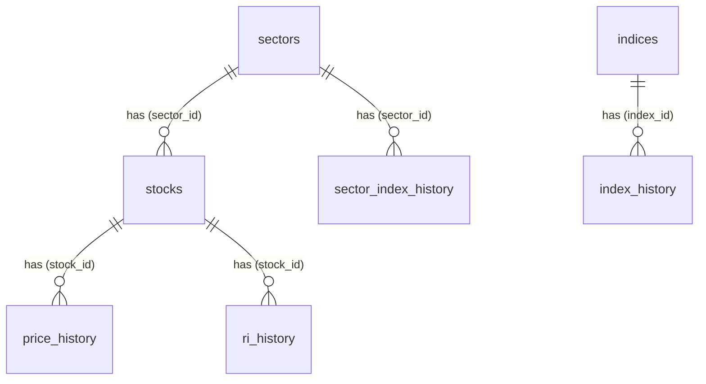

# TSE Data Collector - Database Schema Documentation

## Overview
This document describes the database schema for the TSE (Tehran Stock Exchange) Data Collector project. The database is designed to store comprehensive stock market data including stocks, sectors, indices, price history, and related information.

## Database Structure

### Tables and Relationships

#### 1. sectors (صنایع)
**Primary Key:** id (Integer, Auto-increment)  
**Unique Constraints:** sector_code  
**Description:** Stores information about stock market sectors/industries

| Field | Type | Constraints | Description |
|-------|------|-------------|-------------|
| id | Integer | Primary Key, Auto-increment | Unique identifier |
| sector_code | Float | Unique, Not Null | کد صنعت (Sector code) |
| sector_name | String(200) | Not Null | نام صنعت به فارسی (Sector name in Persian) |
| sector_name_en | String(200) | Nullable | نام صنعت به انگلیسی (Sector name in English) |
| naics_code | String(50) | Nullable | کد NAICS (NAICS code) |
| naics_name | String(200) | Nullable | نام NAICS (NAICS name) |

**Relationships:**
- One-to-Many with `stocks` table (sector.stocks)

#### 2. stocks (سهام)
**Primary Key:** id (Integer, Auto-increment)  
**Unique Constraints:** ticker, web_id  
**Description:** Stores information about individual stocks

| Field | Type | Constraints | Description |
|-------|------|-------------|-------------|
| id | Integer | Primary Key, Auto-increment | Unique identifier |
| ticker | String(50) | Unique, Not Null | نماد سهام (Stock ticker/symbol) |
| name | String(200) | Not Null | نام شرکت (Company name) |
| web_id | String(50) | Unique, Not Null | کد وب (Web identifier) |
| market | String(100) | Not Null | نام بازار (Market name) |
| is_active | Boolean | Default: True | وضعیت فعال بودن (Active status) |
| sector_id | Integer | Foreign Key → sectors.id | ارتباط با صنعت (Sector relationship) |

**Relationships:**
- Many-to-One with `sectors` table (stock.sector)
- One-to-Many with `price_history`, `ri_history`, `intraday_trades`, `shareholder_history` tables

#### 3. price_history (تاریخچه قیمت)
**Primary Key:** id (Integer, Auto-increment)  
**Unique Constraints:** (stock_id, j_date)  
**Description:** Stores daily price history for stocks

| Field | Type | Constraints | Description |
|-------|------|-------------|-------------|
| id | Integer | Primary Key, Auto-increment | Unique identifier |
| stock_id | Integer | Foreign Key → stocks.id, Not Null | ارتباط با سهام (Stock relationship) |
| j_date | String(10) | Not Null | تاریخ شمسی YYYY-MM-DD (Jalali date) |
| date | Date | Not Null | تاریخ میلادی (Gregorian date) |
| weekday | String(10) | Nullable | نام روز هفته (Weekday name) |
| open_price | BigInteger | Nullable | قیمت باز شدن (Opening price) |
| high_price | BigInteger | Nullable | بالاترین قیمت (Highest price) |
| low_price | BigInteger | Nullable | پایین‌ترین قیمت (Lowest price) |
| close_price | BigInteger | Nullable | قیمت بسته شدن (Closing price) |
| final_price | BigInteger | Nullable | قیمت نهایی (Final price) |
| volume | BigInteger | Nullable | حجم معاملات (Trading volume) |
| value | BigInteger | Nullable | ارزش معاملات (Trading value) |
| num_trades | BigInteger | Nullable | تعداد معاملات (Number of trades) |

**Relationships:**
- Many-to-One with `stocks` table (price_history.stock)

#### 4. ri_history (تاریخچه حقیقی-حقوقی)
**Primary Key:** id (Integer, Auto-increment)  
**Unique Constraints:** (stock_id, j_date)  
**Description:** Stores real person vs. legal entity trading history

| Field | Type | Constraints | Description |
|-------|------|-------------|-------------|
| id | Integer | Primary Key, Auto-increment | Unique identifier |
| stock_id | Integer | Foreign Key → stocks.id, Not Null | ارتباط با سهام (Stock relationship) |
| j_date | String(10) | Not Null | تاریخ شمسی YYYY-MM-DD (Jalali date) |
| date | Date | Not Null | تاریخ میلادی (Gregorian date) |
| individual_buy_volume | BigInteger | Nullable | حجم خرید حقیقی (Individual buy volume) |
| individual_sell_volume | BigInteger | Nullable | حجم فروش حقیقی (Individual sell volume) |
| individual_buy_value | BigInteger | Nullable | ارزش خرید حقیقی (Individual buy value) |
| individual_sell_value | BigInteger | Nullable | ارزش فروش حقیقی (Individual sell value) |
| legal_buy_volume | BigInteger | Nullable | حجم خرید حقوقی (Legal entity buy volume) |
| legal_sell_volume | BigInteger | Nullable | حجم فروش حقوقی (Legal entity sell volume) |
| legal_buy_value | BigInteger | Nullable | ارزش خرید حقوقی (Legal entity buy value) |
| legal_sell_value | BigInteger | Nullable | ارزش فروش حقوقی (Legal entity sell value) |

**Relationships:**
- Many-to-One with `stocks` table (ri_history.stock)

#### 5. indices (شاخص‌ها)
**Primary Key:** id (Integer, Auto-increment)  
**Unique Constraints:** index_code  
**Description:** Stores market indices information

| Field | Type | Constraints | Description |
|-------|------|-------------|-------------|
| id | Integer | Primary Key, Auto-increment | Unique identifier |
| index_code | String(50) | Unique, Not Null | کد شاخص (Index code) |
| index_name | String(200) | Not Null | نام شاخص (Index name) |
| index_name_en | String(200) | Nullable | نام شاخص به انگلیسی (Index name in English) |

**Relationships:**
- One-to-Many with `index_history` table (index.index_history)

#### 6. index_history (تاریخچه شاخص)
**Primary Key:** id (Integer, Auto-increment)  
**Unique Constraints:** (index_id, j_date)  
**Description:** Stores historical data for market indices

| Field | Type | Constraints | Description |
|-------|------|-------------|-------------|
| id | Integer | Primary Key, Auto-increment | Unique identifier |
| index_id | Integer | Foreign Key → indices.id, Not Null | ارتباط با شاخص (Index relationship) |
| j_date | String(10) | Not Null | تاریخ شمسی YYYY-MM-DD (Jalali date) |
| date | Date | Not Null | تاریخ میلادی (Gregorian date) |
| weekday | String(10) | Nullable | نام روز هفته (Weekday name) |
| open_value | Numeric(15,2) | Nullable | ارزش باز شدن (Opening value) |
| high_value | Numeric(15,2) | Nullable | بالاترین ارزش (Highest value) |
| low_value | Numeric(15,2) | Nullable | پایین‌ترین ارزش (Lowest value) |
| close_value | Numeric(15,2) | Nullable | ارزش بسته شدن (Closing value) |
| volume | BigInteger | Nullable | حجم معاملات (Trading volume) |
| value | BigInteger | Nullable | ارزش معاملات (Trading value) |

**Relationships:**
- Many-to-One with `indices` table (index_history.index)

#### 7. sector_index_history (تاریخچه شاخص صنایع)
**Primary Key:** id (Integer, Auto-increment)  
**Unique Constraints:** (sector_id, j_date)  
**Description:** Stores historical data for sector indices

| Field | Type | Constraints | Description |
|-------|------|-------------|-------------|
| id | Integer | Primary Key, Auto-increment | Unique identifier |
| sector_id | Integer | Foreign Key → sectors.id, Not Null | ارتباط با صنعت (Sector relationship) |
| j_date | String(10) | Not Null | تاریخ شمسی YYYY-MM-DD (Jalali date) |
| date | Date | Not Null | تاریخ میلادی (Gregorian date) |
| weekday | String(10) | Nullable | نام روز هفته (Weekday name) |
| open_value | Numeric(15,2) | Nullable | ارزش باز شدن (Opening value) |
| high_value | Numeric(15,2) | Nullable | بالاترین ارزش (Highest value) |
| low_value | Numeric(15,2) | Nullable | پایین‌ترین ارزش (Lowest value) |
| close_value | Numeric(15,2) | Nullable | ارزش بسته شدن (Closing value) |

## ER Diagram

